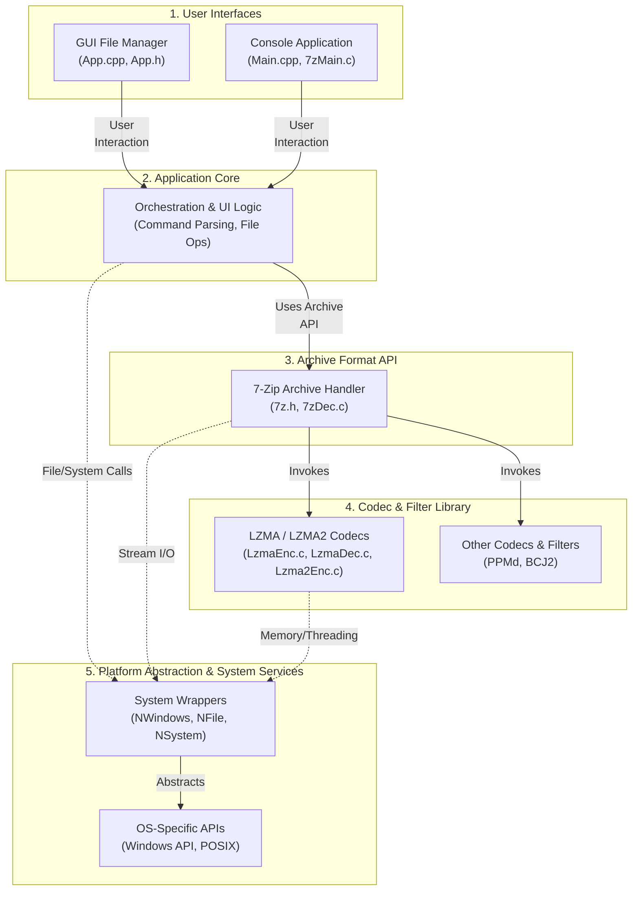

# Architecture Overview - 7zip

> Technical architecture and system design

## System Architecture

### Architecture Diagram

## Overview

7-Zip features a well-defined layered architecture that separates user-facing applications from the high-performance core. The core itself is modular, with a distinct API layer for handling the 7z archive format that sits atop a library of individual C-based compression and filter codecs. This design promotes portability, reusability of the core compression libraries, and clear separation of concerns between UI, application logic, and low-level algorithms.

## Architectural Layers

### User Interfaces

This layer provides user-facing clients for interacting with the archiver, including both a graphical file manager and a command-line utility.

**Technologies:** C++, C, Windows API (Win32, COM), POSIX APIs

### Application Core

Acts as an orchestrator, processing user commands from the UI layer, managing application state, and invoking the underlying archive and codec libraries to perform archiving operations.

**Technologies:** C++, C, Internal System Libraries

### Archive Format API

Defines the public API and data structures for interacting with 7-Zip archives. It abstracts the complexities of the archive structure and coordinates the use of different codecs and filters.

**Technologies:** C, 7-Zip Archive Format

### Codec & Filter Library

Contains the core, low-level implementations of various compression, encryption, and pre-processing filter algorithms. These components are written in C for maximum performance and portability.

**Technologies:** C, LZMA Algorithm, LZMA2 Algorithm, PPMd Algorithm, BCJ2 Filter

### Platform Abstraction & System Services

A cross-cutting layer that provides a consistent interface for interacting with the underlying operating system for tasks like file I/O, memory allocation, and threading, using conditional compilation to switch between platform-specific APIs.

**Technologies:** Windows API, POSIX, C/C++ Standard Libraries, Conditional Compilation

---

*Generated by [Revibe](https://app.revibe.codes) - Code Intelligence Platform*
