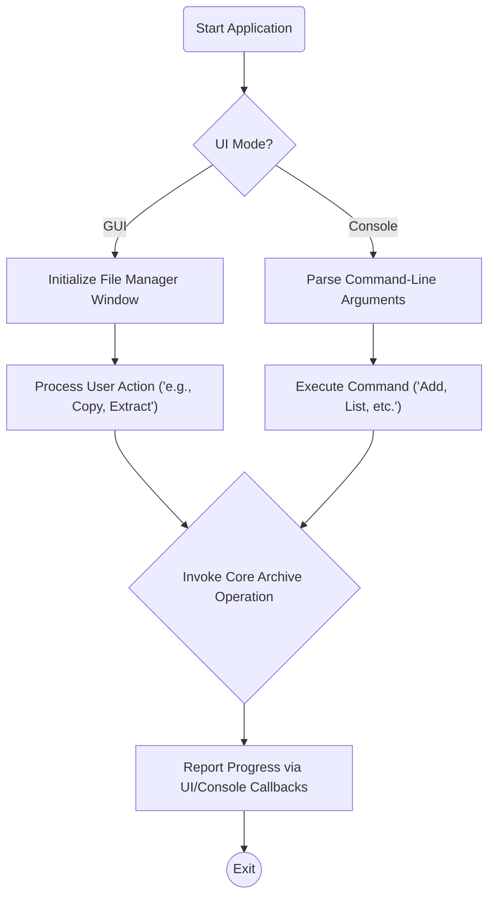
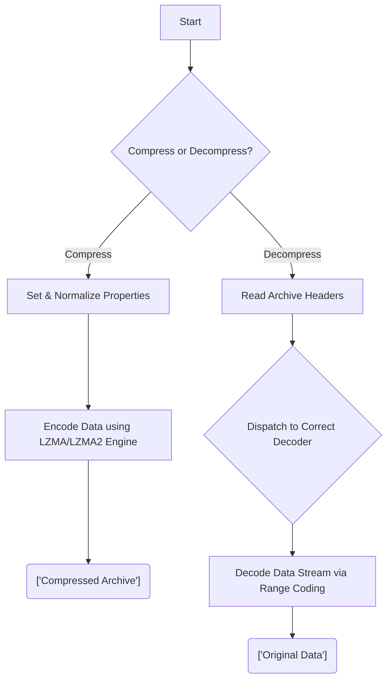
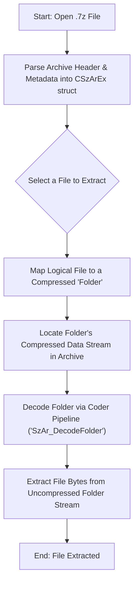
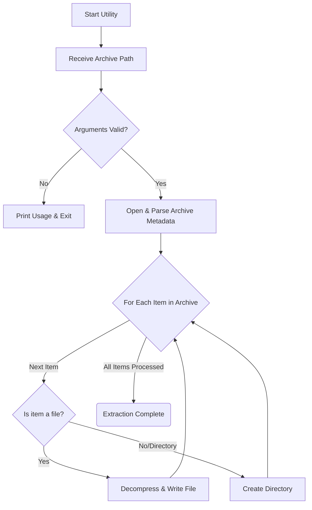

# Business Logic - 7zip

> Core business logic and module interactions

## Overview

## Core Modules

### Archive Management User Interface

Provides both a console and a graphical user interface for users to interact with 7-Zip's archiving capabilities, including creating, extracting, and managing archives.

**Module Flow:**



**Insights:**
- • This module provides dual user interfaces, a graphical file manager and a console application, which both act as frontends to the core 7-Zip archiving engine by processing user input and invoking shared operations via a callback system.
- • The module provides two distinct frontends: a graphical file manager for interactive use and a command-line interface for scripting and automation.
- • Both GUI and Console modes utilize a callback system to receive progress and status updates from the core archiving engine.
- ⚠️ Extensive use of preprocessor directives (#ifdef) manages platform-specific code (Windows vs. others) and different program variants (e.g., 7z, 7za).
- • The File Manager application state, including panel layouts and view settings, is persisted and loaded between sessions.

### Core Compression and Decompression Engine

Implements the fundamental compression and decompression algorithms used by 7-Zip, including LZMA, LZMA2, XZ, and others, providing the core functionality for creating and extracting archives in various formats.

**Module Flow:**



**Insights:**
- • The module implements a layered compression engine that abstracts complex LZMA/LZMA2 parameters for encoding and uses a dispatch system to invoke the correct codec for decoding various archive formats.
- • Compression parameters are abstracted into a single 'level' (0-9), which then derives complex settings like dictionary size, fast bytes, and algorithm choice.
- • The decompression process uses a dispatch mechanism that reads method IDs from the 7z folder data to select the appropriate decoding algorithm (LZMA, LZMA2, BCJ2, Delta, etc.).
- ⚠️ The core decoding logic in LzmaDec.c is implemented using a series of highly condensed, bit-manipulation macros for range decoding.
- • The LZMA2 format is implemented as a wrapper around the core LZMA engine, processing data in independent chunks that can be either LZMA-compressed or stored uncompressed.

### 7-Zip Archive Format Handling

Provides the necessary API and data structures for creating and interacting with 7-Zip's native .7z archive format, enabling reading, writing, and manipulating archive contents.

**Module Flow:**



**Insights:**
- • This interface defines the data structures and functions for parsing a 7z archive's metadata, mapping logical files to compressed data blocks ('folders'), and decoding those blocks to enable file extraction.
- • The data structures heavily utilize bit arrays (e.g., `CSzBitUi32s`, `IsDirs`) to indicate the presence of optional file attributes like CRCs, timestamps, or directory flags.
- • The core abstraction is the `CSzFolder`, which represents a single compressed block that can contain data for multiple files. This decouples logical files from the physical compression streams.
- • The header defines an interface, not an implementation. It exposes the necessary data structures (`CSzArEx`) and a key function (`SzAr_DecodeFolder`) for a client to parse and decompress archive data.

### Build and Configuration System

Handles the compilation and linking process for different components of the 7-Zip project, including the core algorithms, user interfaces, and utilities.

**Module Flow:**

```mermaid
flowchart TD
A["Start: Invoke 'make'"]  -->  B["Top-level makefile reads subdirectories"]
B  -->  C["Recursively build each subdirectory"]
C  -->  D["Sub-makefile loads component configuration"]
D  -->  E{"Set preprocessor flags?\n("e.g., EXTRACT_ONLY")"}
E  -->  F["Include shared build rules ('.mak files')"]
F  -->  G["Compile sources ('.c, .asm') to object files ('.obj')"]
G  -->  H["Link object files into final executable"]
H  -->  I["End: Executable created"]
```

**Insights:**
- • This module uses a recursive makefile system to build various 7-Zip components, leveraging shared includes for common logic and preprocessor flags for feature-specific configuration.
- • The build system employs a recursive make pattern, where a primary makefile invokes make within specified subdirectories.
- • Component-specific features are controlled via CFLAGS preprocessor definitions within individual makefiles, such as building a decoder-only executable.
- • Common build logic, compiler options, and dependency lists are centralized in shared `.mak` files which are included by component makefiles.
- • The build uses precompiled headers (PCH) to accelerate compilation.

### C-Based Extraction Utility

Provides a standalone, lightweight C-based utility specifically designed for extracting archives, primarily for situations where a minimal footprint is required or a simple, focused extraction tool is preferred.

**Module Flow:**



**Insights:**
- • This C-based utility parses a 7z archive file provided via command-line arguments, iterates through its contents, and extracts each file or directory to the local filesystem while handling cross-platform filename encoding.
- • The utility performs manual UTF-16 to UTF-8 filename conversion to support cross-platform compatibility, specifically for non-Windows systems.
- ⚠️ The core extraction logic, including argument parsing, file iteration, path creation, and decompression calls, is contained within a single large main function.
- • Memory management is handled via a custom allocator interface (ISzAlloc) passed to the 7z library functions rather than using standard malloc/free directly in the core logic.


---

*Generated by [Revibe](https://app.revibe.codes) - Code Intelligence Platform*
